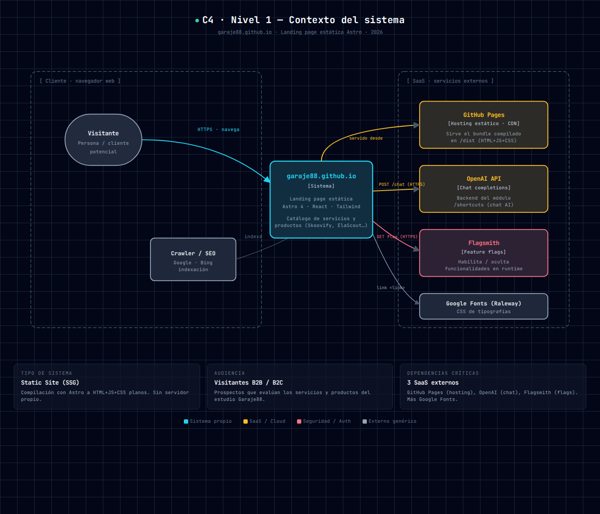
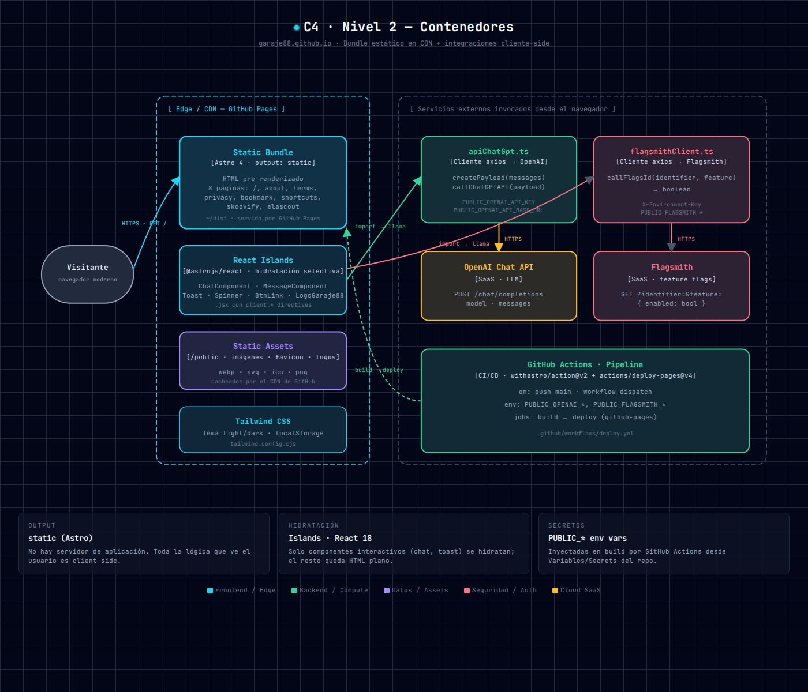
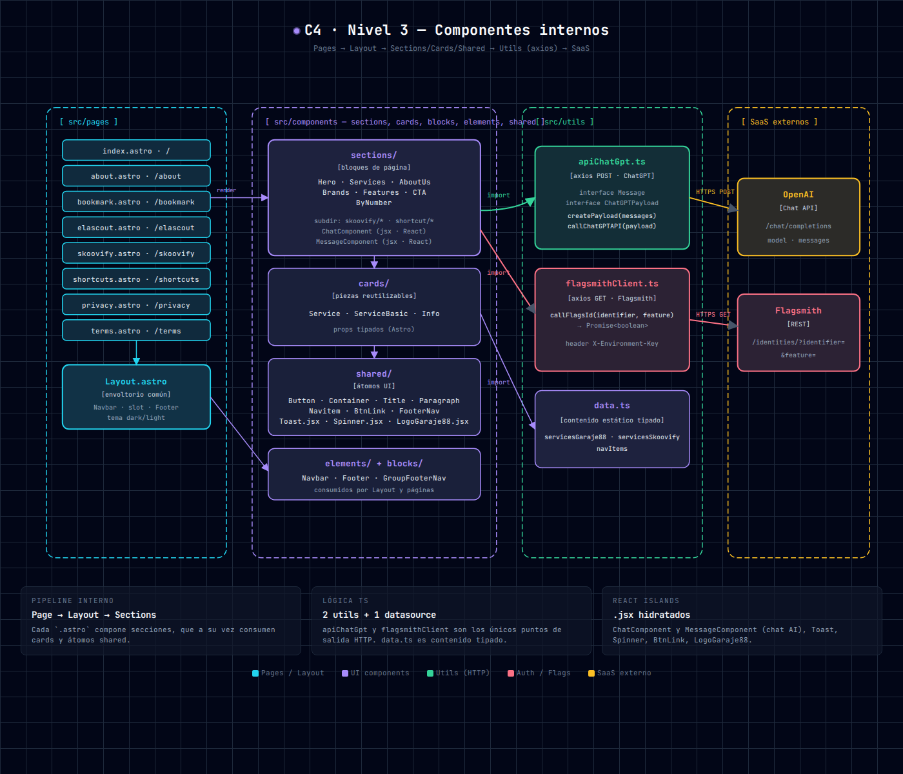
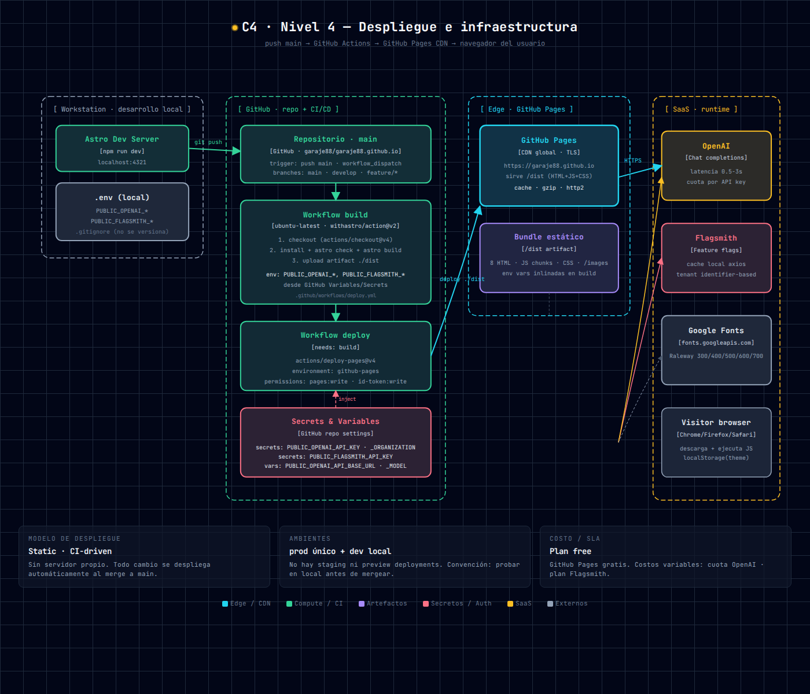

# garaje88.github.io — Documentación Técnica

## 1. Portada

| Campo            | Valor                                            |
| ---------------- | ------------------------------------------------ |
| Producto         | garaje88.github.io · Landing page corporativa    |
| Versión          | 0.0.5                                            |
| Stack principal  | Astro 4 · React 18 · TailwindCSS 3 · TypeScript 5 |
| Tipo             | Sitio estático (SSG · `output: 'static'`)        |
| Hosting          | GitHub Pages · CDN global TLS                    |
| Pipeline         | GitHub Actions · `withastro/action@v2`           |
| Repositorio      | `garaje88/garaje88.github.io`                    |
| URL pública      | https://garaje88.github.io                       |
| Autor            | Carlos Polanco                                   |
| Fecha            | 2026-05-07                                       |

---

## 2. Resumen ejecutivo

`garaje88.github.io` es la **landing page** del estudio Garaje88. Funciona como
escaparate público de servicios y de los productos de la marca (Skoovify, ElaScout,
Bookmark, Shortcuts). El sitio se compila con Astro a HTML estático y se publica
en GitHub Pages mediante un pipeline CI/CD totalmente automático.

Internamente combina:

- **Páginas Astro pre-renderizadas** para SEO y rendimiento.
- **Islas React** (`@astrojs/react`) para los componentes interactivos
  (chat con OpenAI, toasts, spinners, botones animados).
- **TailwindCSS** con tema claro/oscuro persistido en `localStorage`.
- **Dos clientes HTTP TypeScript** (`apiChatGpt.ts`, `flagsmithClient.ts`) que
  llaman desde el navegador a OpenAI Chat Completions y Flagsmith.

No hay servidor de aplicación propio: todo el cómputo del runtime es client-side
o se delega a SaaS externos.

---

## 3. Objetivos

1. **Presencia comercial**: comunicar los servicios del estudio (web apps,
   backends Java/Spring Boot, consultoría) y sus productos.
2. **Captación**: convertir visitantes en *leads* mediante CTA, formularios y
   un módulo de chat asistido por IA.
3. **Time-to-publish bajo**: cualquier cambio mergeado a `main` debe estar en
   producción en minutos sin intervención manual.
4. **Coste cercano a cero**: aprovechar GitHub Pages, GitHub Actions y los
   *free tiers* de OpenAI y Flagsmith.

---

## 4. Alcance del MVP

**Dentro del alcance**:

- 8 rutas estáticas: `/`, `/about`, `/bookmark`, `/elascout`, `/skoovify`,
  `/shortcuts`, `/privacy`, `/terms`.
- Layout común (`Layout.astro`) con `Navbar`, `Footer` y *toggle* de tema.
- Catálogo de servicios renderizado desde `src/utils/data.ts`.
- Módulo de chat con OpenAI accesible desde `/shortcuts`.
- Feature flags vía Flagsmith para habilitar/ocultar funcionalidades.
- Despliegue automático a GitHub Pages al hacer push a `main`.

**Fuera del alcance**:

- Backend propio, base de datos, autenticación de usuario.
- Internacionalización formal (los textos están en inglés/español inline).
- Pruebas E2E o suite unitaria (no hay test runner configurado).
- *Preview deployments* por PR.

---

## 5. Stack técnico

| Capa              | Tecnología                                           |
| ----------------- | ---------------------------------------------------- |
| Framework         | Astro 4.8.6 (`output: 'static'`)                     |
| UI interactivo    | React 18.2.0 + `@astrojs/react` 3.3.4                |
| Estilos           | Tailwind CSS 3.3 + `@astrojs/tailwind` 5.1           |
| Lenguaje          | TypeScript 5.4                                       |
| HTTP cliente      | axios 1.6                                            |
| Feature flags     | flagsmith 4.0 + cliente axios propio                 |
| Animaciones       | `react-canvas-confetti` 2.0                          |
| Calidad de tipos  | `@astrojs/check` 0.7 (`astro check`)                 |
| Bundler           | Vite 5.2 (provisto por Astro)                        |
| CI/CD             | GitHub Actions · `withastro/action@v2` · `actions/deploy-pages@v4` |
| Hosting           | GitHub Pages                                         |
| Tipografía        | Google Fonts · Raleway (300/400/500/600/700)         |

---

## 6. Arquitectura

### 6.1 Visión general

El sistema sigue un patrón **JAMstack puro**:

- *Build time*: Astro genera HTML+JS+CSS estáticos con las páginas, secciones,
  cards y átomos compuestos en árbol.
- *Edge*: GitHub Pages distribuye los archivos por su CDN global con TLS.
- *Client*: el navegador hidrata las islas React e invoca SaaS de terceros
  directamente (OpenAI, Flagsmith) usando claves expuestas como variables
  `PUBLIC_*` (asumiendo riesgo aceptado de exposición client-side).

Cada nivel C4 (contexto, contenedores, componentes, despliegue) está
diagramado en `docs/diagrams/`.

### 6.2 Diagrama de contexto



Actores externos:

- **Visitante** — persona evaluando los servicios o productos.
- **Crawler / SEO** — Google, Bing y similares indexan el HTML pre-renderizado.

SaaS implicados: GitHub Pages, OpenAI, Flagsmith, Google Fonts.

### 6.3 Diagrama de contenedores



Contenedores lógicos:

- **Static Bundle** (Astro): 8 HTML pre-renderizados.
- **React Islands**: componentes interactivos hidratados selectivamente.
- **Static Assets**: `/public/images`, `/public/logos`, favicon.
- **Tailwind CSS**: tema runtime (`light/dark`) persistido en `localStorage`.
- **Pipeline CI/CD**: GitHub Actions con secretos inyectados como `env`.

### 6.4 Diagrama de componentes



Pipeline interno:

```
src/pages/*.astro
   └─ src/layouts/Layout.astro
        ├─ src/components/elements/{Navbar, Footer}.astro
        ├─ src/components/sections/*.astro
        │    ├─ src/components/cards/*.astro
        │    └─ src/components/shared/*.{astro,jsx}
        └─ src/components/sections/shortcut/{ChatComponent,MessageComponent}.jsx
              └─ src/utils/apiChatGpt.ts          → OpenAI
              └─ src/utils/flagsmithClient.ts     → Flagsmith
src/utils/data.ts (contenido tipado: servicios + nav)
```

### 6.5 Diagrama de despliegue



Flujo:

```
desarrollo local (npm run dev)
     │ git push origin main
     ▼
GitHub Actions · build (withastro/action@v2)
     │ env: PUBLIC_OPENAI_*, PUBLIC_FLAGSMITH_*
     │ artifact: ./dist
     ▼
GitHub Actions · deploy (actions/deploy-pages@v4)
     ▼
GitHub Pages · CDN (https://garaje88.github.io)
     ▼
navegador del visitante
     ├─ HTTPS → OpenAI Chat API
     ├─ HTTPS → Flagsmith
     └─ HTTPS → fonts.googleapis.com
```

---

## 7. Modelo de datos

El sitio **no tiene base de datos**. Toda la información se sirve como contenido:

| Origen                   | Tipo            | Contenido                                         |
| ------------------------ | --------------- | ------------------------------------------------- |
| `src/utils/data.ts`      | TS estático     | `servicesGaraje88`, `servicesSkoovify`, `navItems`|
| `src/pages/*.astro`      | Markdown-in-HTML| Texto editorial de cada landing                    |
| `src/components/sections/*` | Astro `.astro`| Layout y copy estructurado                        |
| OpenAI Chat API          | runtime         | Historial de chat dentro de la sesión del cliente |
| Flagsmith                | runtime         | Estado de feature flags por `identifier`          |
| `localStorage`           | navegador       | `appTheme = "light" | "dark"`                     |

Estructuras tipadas relevantes (extraídas del código):

```ts
interface Message {
  role: 'system' | 'user' | 'assistant';
  content: string;
}
interface ChatGPTPayload {
  messages: Message[];
  model: string;
}
```

---

## 8. Autenticación y autorización

| Aspecto              | Estado                                                             |
| -------------------- | ------------------------------------------------------------------ |
| Login de usuarios    | **No aplica** — el sitio es público y anónimo                      |
| Sesión               | Cookie del navegador para preferencias UI (tema)                   |
| OpenAI               | API key en variable `PUBLIC_OPENAI_API_KEY` enviada en `Authorization` |
| Flagsmith            | Environment key en `PUBLIC_FLAGSMITH_API_KEY` (header `X-Environment-Key`) |
| Identificación       | `identifier` arbitrario por usuario para segmentar flags           |

> ⚠️ **Riesgo asumido**: las claves `PUBLIC_*` se inyectan en el bundle estático
> y son visibles al navegador. Esto exige usar tokens de Flagsmith *environment*
> (no admin) y limitar el uso/cuota de la clave OpenAI mediante reglas en el
> proveedor (rate limit, IP allowlist si fuese soportado, monitoreo de gasto).

---

## 9. APIs / contratos

### 9.1 OpenAI Chat Completions (saliente)

| Atributo  | Valor                                                       |
| --------- | ----------------------------------------------------------- |
| Método    | `POST`                                                      |
| URL base  | `PUBLIC_OPENAI_API_BASE_URL`                                |
| Headers   | `Content-Type: application/json` · `Authorization: <key>` · `OpenAI-Organization` |
| Body      | `{ messages: Message[], model: PUBLIC_OPENAI_API_MODEL }`   |
| Cliente   | `src/utils/apiChatGpt.ts`                                   |

### 9.2 Flagsmith (saliente)

| Atributo  | Valor                                                       |
| --------- | ----------------------------------------------------------- |
| Método    | `GET`                                                       |
| URL       | `PUBLIC_FLAGSMITH_BASE_URL?identifier={id}&feature={f}`     |
| Headers   | `Content-Type: application/json` · `X-Environment-Key: <key>` |
| Respuesta | `{ enabled: boolean, ... }`                                 |
| Cliente   | `src/utils/flagsmithClient.ts`                              |

### 9.3 APIs entrantes

No existen. El sitio es servido como recursos estáticos por GitHub Pages.

---

## 10. Despliegue y operaciones

### 10.1 Variables de entorno

| Nombre                          | Tipo      | Origen en CI                        |
| ------------------------------- | --------- | ----------------------------------- |
| `PUBLIC_OPENAI_API_BASE_URL`    | variable  | GitHub Actions Variables             |
| `PUBLIC_OPENAI_API_KEY`         | secreto   | GitHub Actions Secrets               |
| `PUBLIC_OPENAI_API_ORGANIZATION`| secreto   | GitHub Actions Secrets               |
| `PUBLIC_OPENAI_API_MODEL`       | variable  | GitHub Actions Variables             |
| `PUBLIC_FLAGSMITH_BASE_URL`     | variable  | GitHub Actions Variables             |
| `PUBLIC_FLAGSMITH_API_KEY`      | secreto   | GitHub Actions Secrets               |

En local conviven en `.env` (ignorado por `.gitignore`).

### 10.2 Pipeline (`.github/workflows/deploy.yml`)

```yaml
on:
  push:
    branches: [ main ]
  workflow_dispatch:

permissions:
  contents: read
  pages: write
  id-token: write

jobs:
  build:
    runs-on: ubuntu-latest
    steps:
      - uses: actions/checkout@v4
      - uses: withastro/action@v2     # install + astro check + astro build + upload artifact
  deploy:
    needs: build
    environment:
      name: github-pages
      url: ${{ steps.deployment.outputs.page_url }}
    steps:
      - id: deployment
        uses: actions/deploy-pages@v4
```

### 10.3 Comandos

| Comando                | Acción                                          |
| ---------------------- | ----------------------------------------------- |
| `npm install`          | Instala dependencias                            |
| `npm run dev`          | Servidor local en `http://localhost:4321`       |
| `npm run build`        | `astro check && astro build` → `./dist`         |
| `npm run preview`      | Sirve el build local                            |
| `npm run astro -- ...` | Acceso directo al CLI de Astro                  |

### 10.4 Observabilidad

- **Logs**: solo `console.error` en clientes axios (sin centralización).
- **Métricas**: ninguna instrumentada (recomendado: añadir analytics ligero).
- **Alertas**: depende de los dashboards de OpenAI y Flagsmith.

---

## 11. Convenciones de código

- **Estructura**: páginas en `src/pages/`, layouts en `src/layouts/`,
  componentes agrupados por rol en `src/components/{elements,blocks,sections,cards,shared}/`.
- **Componentes Astro vs React**:
  - `.astro` → markup estático y composición.
  - `.jsx` → solo cuando se necesita estado o interacción del cliente.
- **Tailwind**: utilidades inline; tokens semánticos vía variables CSS
  declaradas en `Layout.astro` (`--color-bg`, `--heading-1`, etc.).
- **Tema**: `dark` como clase en `<html>` controlada por `localStorage.appTheme`.
- **Aliases TS**: `@components/*`, `@layouts/*` (configurados en `tsconfig.json`).
- **HTTP**: solo dos puntos de salida (`apiChatGpt.ts`, `flagsmithClient.ts`),
  nunca llamar `axios` desde componentes directamente.
- **Variables de entorno**: prefijo obligatorio `PUBLIC_` para que Astro
  las exponga al bundle del cliente.
- **Commits**: convención `feat: …`, `fix: …`, `docs: …` (visible en git log).
- **Branch model**: `main` (prod), `develop` (integración), `feature/*`.

---

## 12. Roadmap

### Corto plazo (próximas iteraciones)

- [ ] Migrar claves de OpenAI a un proxy serverless (Cloudflare Worker, Vercel
      Edge) para no exponerlas al navegador.
- [ ] Añadir `astro:assets` y optimización automática de imágenes.
- [ ] Configurar analytics privacy-friendly (Plausible / Umami).
- [ ] Sitemap.xml y `robots.txt` mantenidos por Astro.

### Medio plazo

- [ ] Internacionalización (`@astrojs/i18n` o `astro-i18next`) ES/EN.
- [ ] Suite de tests (`vitest` + `@testing-library/react`) con CI separado.
- [ ] Preview deployments por PR (Cloudflare Pages como alternativa).
- [ ] Auditorías Lighthouse automatizadas en cada build.

### Largo plazo

- [ ] CMS *headless* (Sanity, Decap) para que el equipo edite copy sin tocar código.
- [ ] Programa de referidos / blog con MDX.
- [ ] Backend propio (Spring Boot) para formularios de contacto y CRM ligero.
